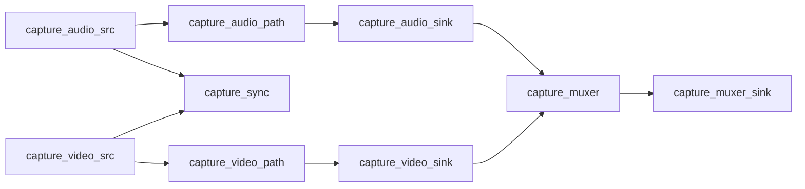
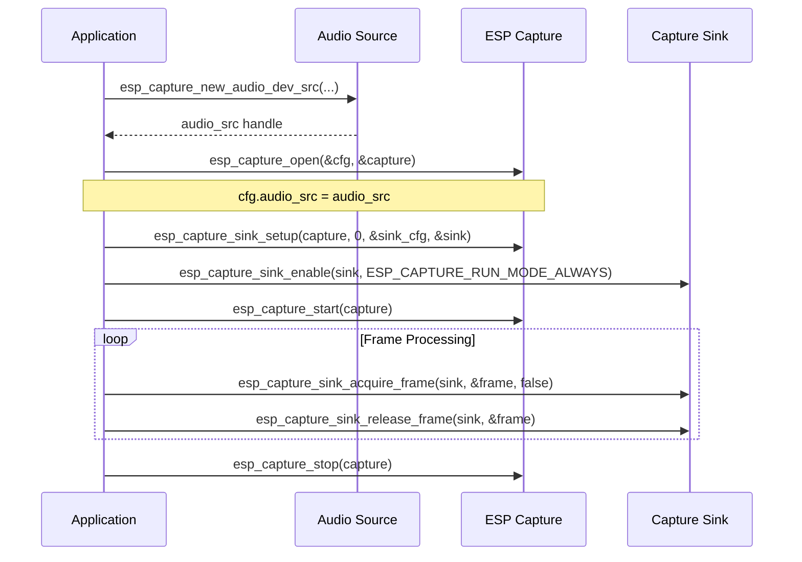

# Espressif Multimedia Capture

- [](https://components.espressif.com/components/espressif/esp_capture)

- [中文版](./README_CN.md)

Espressif Multimedia Capture (**esp_capture**) is a lightweight multimedia capture component developed by Espressif, based on the [ESP-GMF](https://github.com/espressif/esp-gmf/blob/main/README.md) architecture. It features low memory footprint, high flexibility, and a modular design. The component integrates functions such as audio/video encoding, image rotation and scaling, echo cancellation, and text overlay. It is widely applicable to scenarios including audio/video recording, AI large model input, WebRTC, RTMP/RTSP streaming, local storage, and remote monitoring.

## 🔑 Key Features

- 📦 **Low memory overhead** with modular pipeline structure
- 🎚️ **Tight integration with ESP-GMF** for advanced audio/video processing
- 🎥 **Support for multiple input devices**: V4L2, DVP cameras, audio codecs
- 🔁 **Parallel streaming and storage** options
- ⚙️ **Automatic source-sink negotiation** for simplified configuration
- ✨ **Customizable processing pipelines** for professional use cases

## ⚙️ Architecture Overview

A capture system connects sources (input devices) to sinks (output targets) through an intermediate processing path.


| Component          | Description                                                        |
|-------------------|--------------------------------------------------------------------|
| **Capture Source** | Interfaces for physical input devices (camera, mic, etc.)          |
| **Capture Path**   | Processing pipeline (audio/video filters, encoders, overlays)      |
| **Capture Sink**   | Output targets (e.g., streaming, storage, muxers)                  |

### 🧠 AV Synchronization and Muxing

To enable synchronized audio-video muxing, a dedicated sync module aligns timestamps across streams.



## 🔊 Audio Sources

Audio sources are used to acquire audio data from audio input devices connected via various buses (like I2S, USB, etc.).

**Interface**: `esp_capture_audio_src_if_t`

Built-in sources:

- `esp_capture_new_audio_dev_src`: Codec-based audio capture
- `esp_capture_new_audio_aec_src`: Codec-based audio capture with Acoustic Echo Cancellation (AEC)

## 🎥 Video Sources

Video sources are used to capture video data from video input devices connected via various buses (like SPI, MIPI, USB, etc.).

**Interface**: `esp_capture_video_src_if_t`

Built-in sources:

- `esp_capture_new_video_v4l2_src`: V4L2 camera input (via `esp_video`)
- `esp_capture_new_video_dvp_src`: DVP camera input

## 🕓 Stream Synchronization

Stream synchronization is achieved by the `capture_sync` module. `capture_sync` aligns audio and video frame timestamps for synchronized playback or muxing. It is automatically configured through `esp_capture_open`.

## 🔧 Audio/Video Processing Paths

**Interface**: `esp_capture_path_mngr_if_t`

### 🎚️ Audio Path

Built-in:

- `esp_capture_new_gmf_audio_mngr`: Creates audio processing path using `ESP-GMF` with elements like:
  - `aud_rate_cvt` – Sample rate conversion
  - `aud_ch_cvt` – Channel conversion (mono ↔ stereo)
  - `aud_bit_cvt` – Bit depth conversion`
  - `aud_enc` – Audio encoder

**Pipeline Builders** (`esp_capture_pipeline_builder_if_t`):

- `esp_capture_create_auto_audio_pipeline`: Auto-generated audio pipeline based on negotiation
- `esp_capture_create_audio_pipeline`: Prebuilt audio template pipeline

### 🎛️ Video Path

Built-in:

- `esp_capture_new_gmf_video_mngr`: Creates video processing path using `ESP-GMF` with elements like:
  - `vid_ppa` – Resize, crop, color conversion
  - `vid_overlay` – Text/graphic overlays
  - `vid_fps_cvt` – Framerate conversion
  - `vid_enc` – Video encoder

**Pipeline Builders**:

- `esp_capture_create_auto_video_pipeline`: Auto-generated video pipeline based on negotiation
- `esp_capture_create_video_pipeline`: Prebuilt video template pipeline

## 🎞️ Muxing

Mux audio/video into containers for storage or streaming:

- MP4: File-based only
- TS: Supports streaming and file-based

### Data Flow Control for Muxers

The module provides flexible data flow control options for muxers:

- **Muxer-only mode**: All data is consumed by the muxer, preventing access to raw audio/video streams
- **Streaming while storage**: Simultaneous storage and streaming when supported by the muxer
- **Unified API**: Use `esp_capture_sink_acquire_frame` for both muxer output and direct stream access

## 🖋️ Overlays

Overlays are used to mix text or images into original video frames.
Typical use cases include: Adding real-time timestamps or statistical data onto video frames.

**Interface**: `esp_capture_overlay_if_t`

- Built-in: `esp_capture_new_text_overlay`
- Automatically handled if overlay is present in the video path

## ⚡ Auto Capture Mode

Simplified configuration by automatically connecting sources, paths, and sinks.
Typical call sequence for auto capture is shown below (using audio capture as an example):



For detailed examples, see [audio_capture](examples/audio_capture/README.md) and [video_capture](examples/video_capture/README.md)

## 🧩 Customizing Auto Pipelines

1. Register Custom Elements

```c
esp_capture_register_element(capture, ESP_CAPTURE_STREAM_TYPE_AUDIO, proc_element);
```

2. Customize Pipeline Before Start

```c
const char *elems[] = { "aud_ch_cvt", "aud_rate_cvt", "aud_enc" };
esp_capture_sink_build_pipeline(sink, ESP_CAPTURE_STREAM_TYPE_AUDIO, elems, 3);
```

## 🤝 Auto-Negotiation

### Audio

- Automatically inserts elements like `aud_rate_cvt`, `aud_ch_cvt` on demand
- Negotiates format based on encoder requirements
- Elements are configured based on negotiation results

Built-in:

- `esp_capture_audio_pipeline_auto_negotiate` – Auto negotiate from audio source to multiple audio sinks

### Video

- Automatically inserts `vid_ppa`, `vid_fps_cvt` on demand
- Prioritizes high-quality format
- Negotiates source format based on encoder capabilities

Built-in:

- `esp_capture_video_pipeline_auto_negotiate` – Auto negotiate from video source to multiple video sinks

### Fixed Negotiation for Sources

In some cases, auto-negotiation for source format and information may not meet requirements.
Audio sources and video sources support `set_fixed_caps` to fix source format settings and avoid negotiation failure cases.

## ❌ When Auto-Negotiation Fails

In complex pipelines, auto-negotiation may fail (e.g., redundant sample rate converter in one pipeline). Manual configuration is recommended.

## 📦 Binary Size Optimization

Unused elements are excluded unless registered.

### Menuconfig Options

Enable features only when needed:
- `CONFIG_ESP_CAPTURE_ENABLE_AUDIO`: Enable audio support
- `CONFIG_ESP_CAPTURE_ENABLE_VIDEO`: Enable video support

### Optional Registrations

- `mp4_muxer_register()` / `ts_muxer_register()` – on-demand muxers
- `esp_audio_enc_register_default()` / `esp_video_enc_register_default()` – customize encoder usage via menuconfig

## 🔧 Extending esp_capture

You can extend `esp_capture` by:

1. Adding a custom capture source
2. Implementing a new muxer using `esp_muxer`
3. Creating new encoders via `esp_audio_codec` / `esp_video_codec`