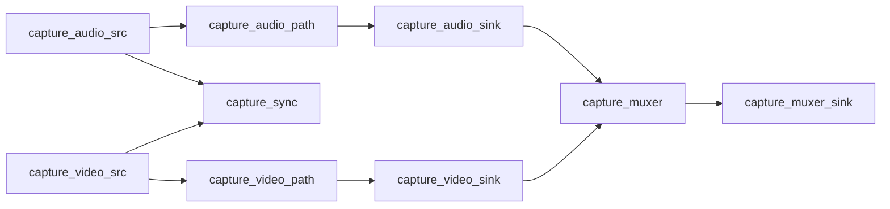
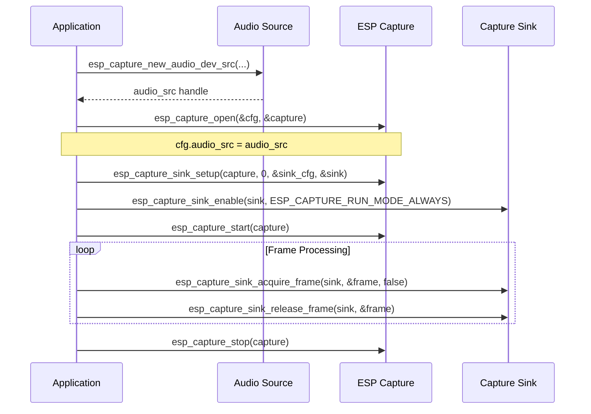

# 乐鑫多媒体采集模块

- [](https://components.espressif.com/components/espressif/esp_capture)

- [English Version](./README.md)

乐鑫多媒体采集模块 (**esp_capture**) 是乐鑫信息科技基于 [ESP-GMF](https://github.com/espressif/esp-gmf/blob/main/README_CN.md) 设计的轻量级多媒体采集组件，具有低内存占用、高灵活性、模块化等特点。该组件集成了音视频编码、图像旋转缩放、回声消除、图层叠加等功能，可广泛适用于音视频录制、AI 大模型输入、WebRTC、RTMP/RTSP 推流、本地存储、远程监控等多种应用场景。

## 🔑 主要特性

- 📦 **低内存开销**，采用模块化流水线结构
- 🎚️ **与 ESP-GMF 深度集成**，实现高级音视频处理
- 🎥 **支持多种输入设备**：V4L2、DVP 摄像头、音频编解码器
- 🔁 **支持并行流式传输与存储**
- ⚙️ **自动源-目标协商机制**，简化配置流程
- ✨ **可定制的处理流水线**，满足专业应用需求

## ⚙️ 架构概览

采集系统通过音视频处理通路将从输入设备（源）（采集到的数据）处理为期望的输出目标（格式）。


|  模块             | 描述                                             |
|------------------|--------------------------------------------------|
| **Capture Source** | 输入设备接口（如摄像头、麦克风等）                   |
| **Capture Path**   | 处理流水线（如音视频效果处理、编码器、叠加器等）       |
| **Capture Sink**   | 输出目标（如数据流、本地存储、等）                   |

### 🧠 音视频同步与复用

为实现音视频同步复用，系统提供同步模块对齐音视频时间戳。



## 🔊 音频源

音频源用于从各种总线（如 I2S、USB 等）连接的音频输入设备获取音频数据。

**接口**：`esp_capture_audio_src_if_t`

内置源：

- `esp_capture_new_audio_dev_src`：基于编解码器的音频采集
- `esp_capture_new_audio_aec_src`：基于编解码器并支持回声消除（AEC）的音频采集

## 🎥 视频源

视频源用于从各种总线（如 SPI、MIPI、USB 等）连接的视频输入设备获取视频数据。

**接口**：`esp_capture_video_src_if_t`

内置源：

- `esp_capture_new_video_v4l2_src`：V4L2 摄像头输入（通过 `esp_video`）
- `esp_capture_new_video_dvp_src`：DVP 摄像头输入

## 🕓 流同步

流同步通过 `capture_sync` 模块实现。`capture_sync` 对齐音频和视频帧时间戳以实现同步播放或复用。它通过 `esp_capture_open` 自动配置。

## 🔧 音视频处理路径

**接口**：`esp_capture_path_mngr_if_t`

### 🎚️ 音频路径

内置：

- `esp_capture_new_gmf_audio_mngr`：使用 `ESP-GMF` 创建音频处理路径，包含类似以下元素：
  - `aud_rate_cvt` – 采样率转换
  - `aud_ch_cvt` – 通道转换（单声道 ↔ 立体声）
  - `aud_bit_cvt` – 采样位数转换
  - `aud_enc` – 音频编码

**流水线构建器**（`esp_capture_pipeline_builder_if_t`）：

- `esp_capture_create_auto_audio_pipeline`：基于协商自动生成的音频流水线
- `esp_capture_create_audio_pipeline`：预构建的音频模板流水线

### 🎛️ 视频路径

内置：

- `esp_capture_new_gmf_video_mngr`：使用 `ESP-GMF` 创建视频处理路径，包含类似以下元素：
  - `vid_ppa` – 调整大小、裁剪、颜色转换
  - `vid_overlay` – 文本/图形叠加
  - `vid_fps_cvt` – 帧率转换
  - `vid_enc` – 视频编码


**流水线构建器**：

- `esp_capture_create_auto_video_pipeline`：基于协商自动生成的视频流水线
- `esp_capture_create_video_pipeline`：预构建的视频模板流水线

## 🎞️ 复用

将音视频复用为适合存储或流式传输的容器：

- MP4：仅支持基于文件的存储
- TS：支持流式传输和基于文件的存储

### 复用器数据流控制

框架为复用器提供灵活的数据流控制选项：

- **仅复用器模式**：所有数据都被复用器消耗，无法访问原始音视频流
- **存储同时流式传输**：当复用器支持时，可同时进行存储和流式传输
- **统一 API**：使用 `esp_capture_sink_acquire_frame` 同时处理复用器输出和直接流访问

## 🖋️ 叠加

叠加用于将文本或图像混合到原始视频帧中。
典型用例包括：在视频帧上添加实时时间戳或统计数据。

**接口**：`esp_capture_overlay_if_t`

- 内置：`esp_capture_new_text_overlay`
- 如果叠加存在于视频路径中，会自动处理

## ⚡ 自动采集模式

通过自动连接源、路径和目标来简化配置。
自动采集的典型调用序列如下所示（以音频采集为例）：



详细示例请参阅 [audio_capture](examples/audio_capture/README.md) 和 [video_capture](examples/video_capture/README.md)

## 🧩 自定义自动流水线

1. 注册自定义元素

```c
esp_capture_register_element(capture, ESP_CAPTURE_STREAM_TYPE_AUDIO, proc_element);
```

2. 在启动前自定义流水线

```c
const char *elems[] = { "aud_ch_cvt", "aud_rate_cvt", "aud_enc" };
esp_capture_sink_build_pipeline(sink, ESP_CAPTURE_STREAM_TYPE_AUDIO, elems, 3);
```

## 🤝 自动协商

### 音频

- 根据需要自动插入 `aud_rate_cvt`、`aud_ch_cvt` 等元素
- 基于编码器要求协商格式
- 根据协商结果配置元素

内置：

- `esp_capture_audio_pipeline_auto_negotiate` – 从音频源到多个音频目标的自动协商

### 视频

- 根据需要自动插入 `vid_ppa`、`vid_fps_cvt` 等元素
- 优先使用高质量格式
- 基于编码器能力协商源格式

内置：

- `esp_capture_video_pipeline_auto_negotiate` – 从视频源到多个视频目标的自动协商

### 源的固定协商

在某些情况下，源格式和信息的自动协商可能无法满足要求。
音频源和视频源支持 `set_fixed_caps` 来固定源格式设置，避免进入协商失败的情况。

## ❌ 自动协商失败时

在复杂流水线中，自动协商可能失败（例如，一个流水线中有冗余的采样率转换器）。建议使用手动配置。

## 📦 二进制大小优化

未使用的元素会被排除，除非已注册。

### Menuconfig 选项

仅在需要时启用功能：
- `CONFIG_ESP_CAPTURE_ENABLE_AUDIO`：启用音频支持
- `CONFIG_ESP_CAPTURE_ENABLE_VIDEO`：启用视频支持

### 可选注册

- `mp4_muxer_register()` / `ts_muxer_register()` – 按需复用器
- `esp_audio_enc_register_default()` / `esp_video_enc_register_default()` – 通过 menuconfig 自定义编码器使用

## 🔧 扩展 esp_capture

您可以通过以下方式扩展 `esp_capture`：

1. 添加自定义采集源
2. 使用 `esp_muxer` 实现新的复用器
3. 通过 `esp_audio_codec` / `esp_video_codec` 创建新编码器
4. 向 `ESP-GMF` 流水线添加自定义处理元素
5. 为复杂工作流设计自定义采集路径，使用 `esp_capture_advance_open`
